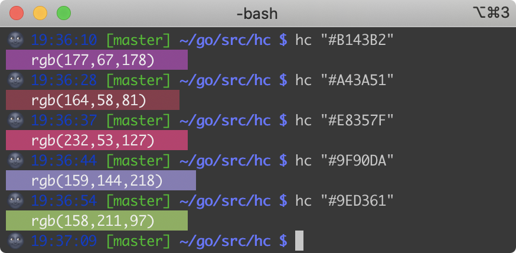

### hc

preview hex color in terminal

### Usage

```
hc <hex color>
```

### Screenshot



### Requirements

A terminal with truecolor support

see https://gist.github.com/XVilka/8346728#now-supporting-true-color
